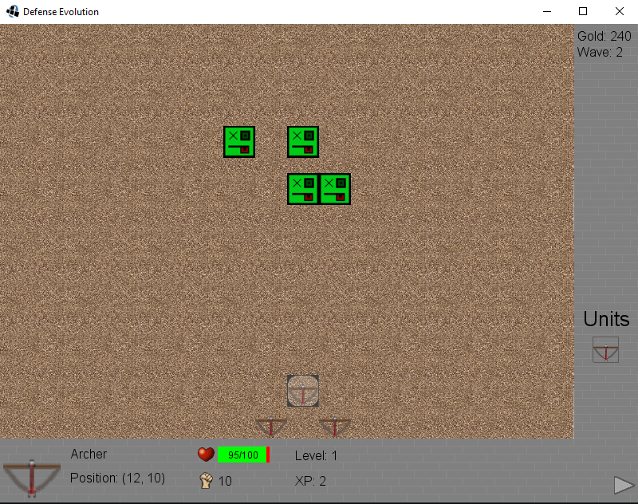
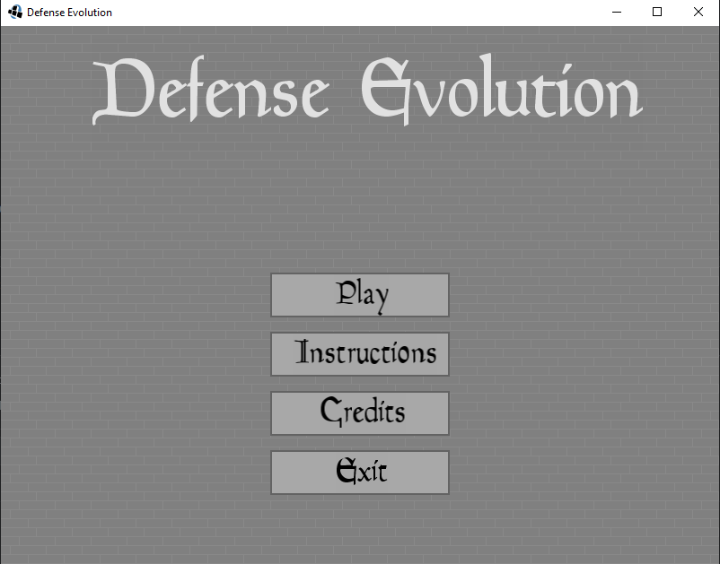

# Defense-Evolution

This is a tower defense game I created back in 2014. It is my first original game and uses a lot of new tools I picked up. The code is written in Java with LWJGL for OpenGL graphics.

To make this game, I created my own lightweight 2D game engine that supports:
* Entity management
* GUI components (buttons, text boxes, custom fonts)
* Sprite rendering with animation from spritesheets
* Sounds for gameplay music and effects

Main menu:

